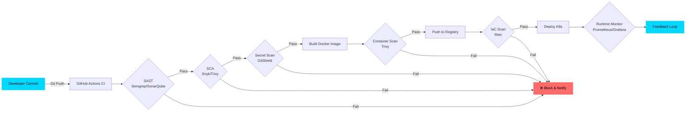

<div align="center">


<br/>

<p>
  
  
  
</p>

<br/>

<p align="center">
  <a href="#-about">About</a> ◈
  <a href="#-tech-arsenal">Skills</a> ◈
  <a href="#-featured-work">Projects</a> ◈
  <a href="#-devsecops-philosophy">Pipeline</a> ◈
  <a href="#-github-analytics">Stats</a> ◈
  <a href="#-connect">Connect</a>
</p>

</div>

---

## 👋 About Me

```yaml
name: Nejamul Haque
title: DevSecOps & Cloud Security Engineer
location: Bettiah, Bihar, India 🇮🇳
education: B.Tech Computer Science (2023–2027)
current_role: Cyber Security Intern @ UP Police (APCSIP-2026)
philosophy: Security is an infrastructure boundary, not a late-stage patch
seeking: Internship & Placement Roles (2026–2027)
portfolio: nejumulhaque.vercel.app
email: nejamulhaque.05@gmail.com
```

### What I Do

| Focus Area | Description |
|:-----------|:------------|
| 🔒 **Shift Left** | Embed automated security controls, SAST/SCA, and container checks directly into CI/CD pipelines |
| 🛡️ **Build Tools** | GitShield (secret scanner), Sentinel Daemon (auto-firewall), Threat Intel Parser (SIEM-ready logs) |
| 🌐 **Full-Stack** | Shipped 3 production SaaS apps (React, Next.js, PostgreSQL) before specializing in security |
| 👮 **Law Enforcement** | Analyzed real cybercrime mechanisms under UP Police; built hardening tools from live threat findings |

---

## ⚡ Tech Arsenal

<details open>
<summary><b>Systems & Infrastructure</b></summary>
<br>


</details>

<details open>
<summary><b>Development & Automation</b></summary>
<br>


</details>

<details open>
<summary><b>Cloud & Containers</b></summary>
<br>


</details>

<details>
<summary><b>Monitoring & Data</b></summary>
<br>


</details>

<details>
<summary><b>🔒 Security Frameworks & Standards</b></summary>
<br>


</details>

---

## 🚀 Featured Work

### Security Tooling

| Project | Description | Impact | Stack |
|:--------|:------------|:-------|:------|
| 🛡️ [**GitShield**](https://github.com/NejamulHaque/GitShield) | Native Git pre-commit hook that intercepts hardcoded AWS keys, RSA private keys, and API tokens before they enter version control | Zero dependencies · regex engine · 100% recall target on known patterns | `Python` `Regex` `Git Hooks` |
| 🔥 [**Sentinel Daemon**](https://github.com/NejamulHaque/sentinel-daemon) | systemd-managed daemon that watches auth.log and autonomously firewalls SSH brute-force attackers at the kernel level | 14 IPs blocked in 3 days · 1.8ms detection latency · 0 false positives | `Python` `systemd` `iptables` |
| 📊 [**Threat Intel Parser**](https://github.com/NejamulHaque/threat-log-parser) | Parses raw access logs for SQLi, XSS, and scanner footprints; enriches IPs against live threat feeds; exports structured JSON | 7 log lines parsed in 1.8s · 4 attack categories flagged | `Python` `urllib` `JSON` |

### Full-Stack Applications

| Project | Description | Stack |
|:--------|:------------|:------|
| 📝 [**Irus AI**](https://github.com/NejamulHaque/ProResume-Builder) | Irus AI — Your Personal AI Command Center Chat • Live Web Search • Document Intelligence • Image Generation • Long-Term Memory • Voice Mode A full-stack, production-grade AI assistant platform | `Next.js` `Node.js` `PostgreSQL` |
| 📝 [**ProResume-Builder**](https://github.com/NejamulHaque/ProResume-Builder) | ATS-friendly resume SaaS with authentication and database-backed user data | `Next.js` `Node.js` `PostgreSQL` |
| 📄 [**CollabSheets**](https://github.com/NejamulHaque/CollabSheets) | Real-time collaborative editor with WebSockets | `React` `Node.js` `WebSockets` |
| 💰 [**Nestfy**](https://github.com/NejamulHaque/Nestfy) | Smart finance tracker with automated categorization | `React` `Node.js` `PostgreSQL` |

<div align="center">
  <a href="https://github.com/NejamulHaque?tab=repositories"></a>
</div>

---

## 🧠 DevSecOps Philosophy



**Every stage enforces a security gate — no exceptions, no manual checkpoints.**

---

## 📊 GitHub Analytics

<div align="center">
  
  
</div>

<br/>

<div align="center">
  
</div>

<br/>

<div align="center">
  
</div>

---

## 🎯 Continuous Learning

<div align="center">
  <a href="https://leetcode.com/NejamulHaque"></a>
  <a href="https://tryhackme.com/p/NejamulHaque"></a>
  <a href="https://www.hackerrank.com/NejamulHaque"></a>
</div>

### Certification Roadmap

| Status | Certification | Timeline |
|:-------|:--------------|:---------|
| ✅ In Progress | AWS Cloud Practitioner · CompTIA Security+ | Current |
| 🎯 Target | AWS Security Specialty · CKS (Certified Kubernetes Security Specialist) | 6–12 months |
| 📚 Future | OSCP · LFCS (Linux Foundation Certified SysAdmin) | 12–24 months |

---

## 📰 Latest Write-ups

- [**Building Your First AI-Powered Web App: A Step-by-Step Guide**](https://nejamulhaque.medium.com/building-your-first-ai-powered-web-app-a-step-by-step-guide-0048e5c8cbe0)
- [**Shifting Left: Catching Hardcoded Secrets Before They Hit Git History**](https://github.com/NejamulHaque/GitShield)
- [**From Access Logs to SIEM-Ready JSON: A Threat Intelligence Pipeline**](https://github.com/NejamulHaque/threat-log-parser)

<div align="center">
  <a href="https://nejamulhaque.medium.com/"></a>
</div>

---

## 🐍 Contribution Activity

<div align="center">
  <picture>
    <source media="(prefers-color-scheme: dark)" srcset="https://raw.githubusercontent.com/NejamulHaque/NejamulHaque/output/github-contribution-grid-snake-dark.svg"/>
    <source media="(prefers-color-scheme: light)" srcset="https://raw.githubusercontent.com/NejamulHaque/NejamulHaque/output/github-contribution-grid-snake.svg"/>
    
  </picture>
</div>

---

## 🌐 Connect

<div align="center">
  <a href="https://linkedin.com/in/NejamulHaque"></a>
  <a href="https://x.com/Nejamul_Haque_"></a>
  <a href="https://nejamulhaque.vercel.app"></a>
  <a href="https://nejamulhaque.medium.com/"></a>
  <a href="mailto:nejamulhaque.05@gmail.com"></a>
</div>

### ☕ Support My Work

- **UPI (India):** `nejamulhaque@upi`
- **Buy Me a Coffee:** [buymeacoffee.com/nejamulhaque](https://www.buymeacoffee.com/nejamulhaque)

---

<div align="center">
  
</div>

<div align="center">
  <br/>
  <b>⭐ Star my repos if you find them helpful!</b><br/>
  <sub>🤝 Open to DevSecOps internships, entry-level roles & collaborations</sub><br/>
  <sub>Made with 💙 and a commitment to shifting security left</sub>
</div>
