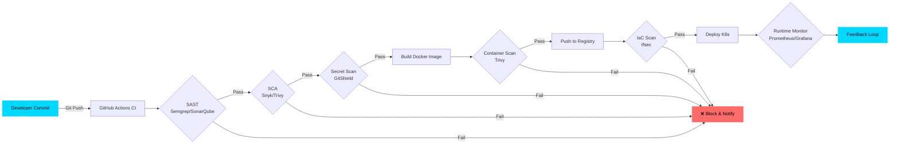

<div align="center">


<p align="center">
  <a href="https://github.com/NejamulHaque"></a>
  <a href="https://github.com/NejamulHaque?tab=followers"></a>
  
  
  
</p>

<p align="center">
  
</p>

<p align="center">
  <a href="#-about-me">About</a> •
  <a href="#-tech-arsenal">Skills</a> •
  <a href="#-featured-security-projects">Projects</a> •
  <a href="#-devsecops-pipeline-philosophy">Pipeline</a> •
  <a href="#-github-intelligence">Stats</a> •
  <a href="#-connect--collaborate">Connect</a>
</p>

</div>

---

## 👋 About Me

```json
{
  "name": "Nejamul Haque",
  "title": "DevSecOps & Cloud Security Engineer",
  "location": "Bettiah, Bihar, India 🇮🇳",
  "education": "B.Tech Computer Science (2023–2027)",
  "currentRole": "Cyber Security Intern @ UP Police (APCSIP-2026)",
  "philosophy": "Security is an infrastructure boundary, not a late-stage patch.",
  "specialties": [
    "Automated Security Controls",
    "Container & CI/CD Hardening",
    "Infrastructure as Code Security",
    "Log Forensics & Threat Intelligence"
  ],
  "available": "Internship & Placement Roles (2026–2027)",
  "portfolio": "https://nejamulhaque.vercel.app",
  "contact": "nejamulhaque.05@gmail.com"
}
```

**What I do:**
- 🔒 **Shift Security Left** — embed automated security controls, static analysis, and container checks directly into CI/CD pipelines.
- 🛡️ **Build Security Tools** — creator of *GitShield* (secret scanner), *Sentinel Daemon* (auto-firewall), and *Threat Intel Parser* (SIEM-ready logs).
- 🤖 **Ship AI Platforms** — *Irus AI*, a production-grade personal AI command center deployed free with a hardened DevSecOps pipeline.
- 🌐 **Full-Stack Foundation** — shipped 3 production SaaS apps (React, Next.js, PostgreSQL) before specializing in security.
- 👮 **Law Enforcement Experience** — analyzed real cybercrime mechanisms under UP Police frameworks; built hardening tools from live threat findings.

---

## ⚡ Tech Arsenal

<table>
<tr>
<td width="50%" valign="top">

### 🐧 Systems & OS


</td>
<td width="50%" valign="top">

### 🌐 Networking & Defense


</td>
</tr>
<tr>
<td width="50%" valign="top">

### 💻 Programming & Scripting


</td>
<td width="50%" valign="top">

### 🔧 Version Control & CI/CD


</td>
</tr>
<tr>
<td width="50%" valign="top">

### 🚀 Cloud & Containers


</td>
<td width="50%" valign="top">

### 🛡️ DevSecOps Toolchain


</td>
</tr>
<tr>
<td width="50%" valign="top">

### 📊 Monitoring & Observability


</td>
<td width="50%" valign="top">

### 🗄️ Databases & APIs


</td>
</tr>
</table>

<details>
<summary><b>🔒 Security Frameworks & Standards I Follow</b></summary>
<br>


</details>

---

## 🚀 Featured Security Projects

<table>
<tr>
<td width="50%" valign="top">

### 🤖 [Irus AI](https://github.com/NejamulHaque/Irus-AI)
**Personal AI Command Center**

Streaming LLM chat, live web search, document intelligence, image generation, and long-term memory — deployed free with a hardened DevSecOps pipeline.

**Impact:** Live on Render · PWA installable · Gitleaks → Bandit → pip-audit → Trivy → Pytest → auto-deploy · zero paid dependencies
**Stack:** `Flask` `PostgreSQL` `Groq` `Docker`

</td>
<td width="50%" valign="top">

### 🛡️ [GitShield](https://github.com/NejamulHaque/GitShield)
**CLI Secret & Security Auditor**

Native Git pre-commit hook that intercepts hardcoded AWS keys, RSA private keys, and API tokens before they enter version control.

**Impact:** Zero dependencies · regex engine · 100% recall target on known patterns
**Stack:** `Python` `Regex Engine` `Git Hooks`

</td>
</tr>
<tr>
<td width="50%" valign="top">

### 🔥 [Sentinel Daemon](https://github.com/NejamulHaque/sentinel-daemon)
**Auto-Firewall & Log Parser**

systemd-managed daemon that watches auth.log and autonomously firewalls SSH brute-force attackers at the kernel level.

**Impact:** 14 IPs blocked in 3 days · 1.8ms detection latency · 0 false positives
**Stack:** `Python` `systemd` `iptables` `Regex`

</td>
<td width="50%" valign="top">

### 📊 [Threat Intel Parser](https://github.com/NejamulHaque/threat-log-parser)
**SIEM-Ready Log Analyzer**

Parses raw access logs for SQLi, XSS, and scanner footprints; enriches IPs against live threat feeds; exports structured JSON.

**Impact:** 7 log lines parsed in 1.8s · 4 attack categories flagged
**Stack:** `Python` `urllib` `JSON` `Regex`

</td>
</tr>
</table>

<details>
<summary><b>📦 More Projects (Full-Stack & Collaboration)</b></summary>
<br>

| Project | Description | Tech Stack |
|---------|-------------|------------|
| [CollabSheets](https://github.com/NejamulHaque/CollabSheets) | Real-time collaborative editor with WebSockets | React, Node.js, WebSockets, PostgreSQL |
| [ProResume-Builder](https://github.com/NejamulHaque/ProResume-Builder) | ATS-friendly resume SaaS with auth & DB backing | Next.js, Node.js, PostgreSQL |
| [Nestfy](https://github.com/NejamulHaque/Nestfy) | Smart finance tracker with automated categorization | React, Node.js, PostgreSQL |

</details>

<p align="center">
  <a href="https://github.com/NejamulHaque?tab=repositories"></a>
</p>

---

## 🧠 DevSecOps Pipeline Philosophy



**Every stage enforces a security gate — no exceptions, no manual checkpoints.**

---

## 📊 GitHub Intelligence

<p align="center">
  
  
</p>

<p align="center">
  
</p>

<p align="center">
  
</p>

---

## 🎯 Practice & Continuous Learning

<p align="center">
  <a href="https://leetcode.com/NejamulHaque"></a>
  <a href="https://tryhackme.com/p/NejamulHaque"></a>
  <a href="https://www.hackerrank.com/NejamulHaque"></a>
</p>

### 🗺️ Certification Roadmap

| Status | Certification | Timeline |
|:-------|:--------------|:---------|
| ✅ **In Progress** | AWS Cloud Practitioner · CompTIA Security+ | Current |
| 🎯 **Target** | AWS Security Specialty · CKS (Certified Kubernetes Security Specialist) | 6–12 months |
| 📚 **Future** | OSCP · LFCS (Linux Foundation Certified SysAdmin) | 12–24 months |

### 🎓 Completed Training
- **APCSIP‑2026 Cyber Security Program** — UP Police, Amroha Cyber Cell
- **Artificial Intelligence For All** — Infosys Springboard
- **Introduction to Generative AI** — Google Cloud
- **Cybersecurity** — Tech Mahindra
- **AI Fluency: Framework & Foundations** — Anthropic Academy

---

## 📰 Latest Write-ups

- 📖 [**Building Your First AI-Powered Web App: A Step-by-Step Guide**](https://nejamulhaque.medium.com/building-your-first-ai-powered-web-app-a-step-by-step-guide-0048e5c8cbe0)
- 🛡️ [**Shifting Left: Catching Hardcoded Secrets Before They Hit Git History**](https://github.com/NejamulHaque/GitShield)
- 📊 [**From Access Logs to SIEM-Ready JSON: A Threat Intelligence Pipeline**](https://github.com/NejamulHaque/threat-log-parser)

<p align="center">
  <a href="https://nejamulhaque.medium.com/"></a>
</p>

---

## 🐍 Contribution Activity

<p align="center">
  <picture>
    <source media="(prefers-color-scheme: dark)" srcset="https://raw.githubusercontent.com/NejamulHaque/NejamulHaque/output/github-contribution-grid-snake-dark.svg"/>
    <source media="(prefers-color-scheme: light)" srcset="https://raw.githubusercontent.com/NejamulHaque/NejamulHaque/output/github-contribution-grid-snake.svg"/>
    
  </picture>
</p>

---

## 🌐 Connect & Collaborate

<p align="center">
  <a href="https://linkedin.com/in/NejamulHaque"></a>
  <a href="https://x.com/Nejamul_Haque_"></a>
  <a href="https://nejamulhaque.vercel.app"></a>
  <a href="https://nejamulhaque.medium.com/"></a>
  <a href="mailto:nejamulhaque.05@gmail.com"></a>
</p>

### ☕ Support My Work
- **UPI (India):** `nejamulhaque@upi`
- **Buy Me a Coffee:** [buymeacoffee.com/nejamulhaque](https://www.buymeacoffee.com/nejamulhaque)

---

<p align="center">
  
</p>

<p align="center">
  <b>⭐ Star my repos if you find them helpful!</b><br/>
  <sub>🤝 Open to DevSecOps internships, entry-level roles & collaborations</sub><br/>
  <sub>Made with 💙 and a commitment to shifting security left</sub>
</p>
