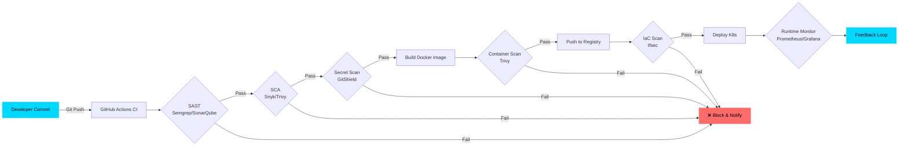

<!-- HEADER BANNER -->

 

<!-- BADGES & PORTFOLIO LINKS -->

  
  

  
  
  
  

 

<!-- TYPING SVG -->

  

---

### 🛡️ About Me

> *"I don't just write code, I secure the infrastructure it runs on."*

I'm **Nejamul Haque** — a DevSecOps & Cloud Security Engineer embedding automated security controls, container checks, and static analysis directly into CI/CD pipelines. Security is an infrastructure boundary, not a late-stage patch.

*   🌐 **My Portfolios:**
    *   **DevSecOps & Security Engineering:** [nejamulhaque.vercel.app](https://nejamulhaque.vercel.app/)
    *   **Full-Stack & SaaS Development (Haque And Sons):** [haqueandsons.vercel.app](https://haqueandsons.vercel.app/)
*   🔒 **Shift Security Left** — Embedding automated security controls directly into CI/CD pipelines.
*   🛡️ **Build Security Tools** — Creator of *GitShield*, *Sentinel Daemon*, *Threat Intel Parser*, and *Irus AI*.
*   👮 **Law Enforcement Experience** — Cyber Security Intern @ UP Police (APCSIP-2026).

---

### ⚡ Tech Arsenal

<table align="center" width="100%">
  <tr>
    <td align="center" width="50%">
      <h3>🐧 Systems & OS</h3>
      

        
        
        
        
      

    </td>
    <td align="center" width="50%">
      <h3>🌐 Networking & Defense</h3>
      

        
        
        
        
      

    </td>
  </tr>
  <tr>
    <td align="center" width="50%">
      <h3>💻 Programming & Scripting</h3>
      

        
        
        
        
      

    </td>
    <td align="center" width="50%">
      <h3>🔧 Version Control & CI/CD</h3>
      

        
        
        
        
      

    </td>
  </tr>
  <tr>
    <td align="center" width="50%">
      <h3>🚀 Cloud & Containers</h3>
      

        
        
        
        
      

    </td>
    <td align="center" width="50%">
      <h3>🛡️ DevSecOps Toolchain</h3>
      

        
        
        
        
      

    </td>
  </tr>
</table>

---

### 🚀 Featured Security Projects

<table align="center" width="100%">
  <tr>
    <th width="33%">Project</th>
    <th width="33%">Tech Stack</th>
    <th width="34%">Impact / Details</th>
  </tr>
  <tr>
    <td><a href="https://github.com/NejamulHaque/Irus-AI"><b>Irus AI</b></a> Personal AI Command Center</td>
    <td><code>Flask</code> <code>PostgreSQL</code> <code>Docker</code></td>
    <td>Production-grade AI assistant (Chat, Search, Doc QA, Memory) deployed free on Render with a hardened DevSecOps pipeline (Gitleaks → Bandit → Trivy → Pytest).</td>
  </tr>
  <tr>
    <td><a href="https://github.com/NejamulHaque/sentinel-daemon"><b>Sentinel Daemon</b></a> Auto-Firewall & Log Parser</td>
    <td><code>Python</code> <code>systemd</code> <code>iptables</code></td>
    <td>Autonomously firewalls SSH brute-force attackers at the kernel level. Blocked <b>14 IPs</b> in 3 days with <b>1.8ms</b> latency and <b>0</b> false positives.</td>
  </tr>
  <tr>
    <td><a href="https://github.com/NejamulHaque/GitShield"><b>GitShield</b></a> CLI Secret Auditor</td>
    <td><code>Python</code> <code>Regex</code> <code>Git Hooks</code></td>
    <td>Native pre-commit hook intercepting AWS keys, PEM private keys, and risky permissions (<code>chmod 777</code>) before they enter Git history. Zero dependencies.</td>
  </tr>
  <tr>
    <td><a href="https://github.com/NejamulHaque/threat-log-parser"><b>Threat Intel Parser</b></a> SIEM-Ready Log Analyzer</td>
    <td><code>Python</code> <code>urllib</code> <code>JSON</code></td>
    <td>Regex-matches SQLi/XSS footprints, enriches flagged IPs against live HTTPS threat feeds, and exports SIEM-ready JSON reports.</td>
  </tr>
</table>

<b>📦 More Projects (Full-Stack & Collaboration)</b>

 

| Project | Description | Tech Stack |
|---------|-------------|------------|
| [CollabSheets](https://github.com/NejamulHaque/CollabSheets) | Real-time collaborative editor with WebSockets | React, Node.js, WebSockets, PostgreSQL |
| [ProResume-Builder](https://github.com/NejamulHaque/ProResume-Builder) | ATS-friendly resume SaaS with auth & DB backing | Next.js, Node.js, PostgreSQL |
| [Nestfy](https://github.com/NejamulHaque/Nestfy) | Smart finance tracker with automated categorization | React, Node.js, PostgreSQL |

  

---

### 🧠 DevSecOps Pipeline Philosophy

---

### 📊 GitHub Intelligence

<!-- STATS & LANGUAGES (Self-hosted via GitHub Actions to avoid rate limits) -->

  
  

<!-- STREAK -->

  

<!-- ACTIVITY GRAPH -->

  

<!-- CONTRIBUTION SNAKE -->

  <picture>
    <source media="(prefers-color-scheme: dark)" srcset="https://raw.githubusercontent.com/NejamulHaque/NejamulHaque/output/github-contribution-grid-snake-dark.svg"/>
    <source media="(prefers-color-scheme: light)" srcset="https://raw.githubusercontent.com/NejamulHaque/NejamulHaque/output/github-contribution-grid-snake.svg"/>
    
  </picture>

---

### 🎯 Continuous Learning & Roadmap

| Status | Certification | Timeline |
|:-------|:--------------|:---------|
| ✅ **In Progress** | AWS Cloud Practitioner · CompTIA Security+ | Current |
| 🎯 **Target** | AWS Security Specialty · CKS (Kubernetes Security) | 6–12 months |
| 📚 **Future** | OSCP · LFCS (Linux Foundation SysAdmin) | 12–24 months |

---

### 🌐 Connect & Collaborate

  
  

  
  
  
  

 

  

