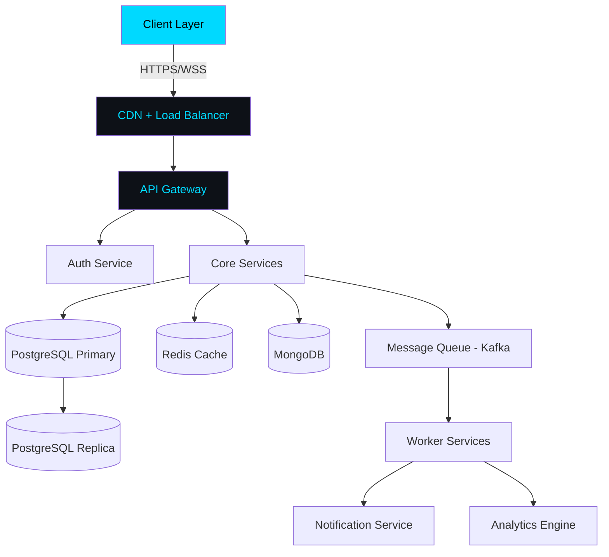

<!-- Header Banner -->


<!-- Live Badges Row -->
<div align="center">
  <a href="https://github.com/NejamulHaque">
    
  </a>
  
  
  
  
</div>

<br/>

<!-- Animated Terminal Typing -->
<div align="center">
  
</div>

---

 About Me
<!--  -->
```json
{
  "name"           : "Nejamul Haque",
  "title"          : "Full Stack & AI Engineer | MERN Specialist",
  "location"       : "India 🇮🇳",
  "available"      : true,
  "experience"     : "3+ Years",
  "education"      : "B.Tech Computer Science",
  "specialization" : "MERN Stack | Microservices | Cloud",
  "currentFocus"   : ["System Design", "DSA Mastery", "Cloud Architecture"],
  "hobbies"        : ["Competitive Programming", "Open Source", "Tech Blogging"],
  "portfolio"      : "https://portfolio.nejamulhaque.vercel.app",
  "contact"        : "nejamulhaque.05@gmail.com",
  "lifePhilosophy" : "Ship fast. Learn faster. Scale always. 🚀"
}
```
<br clear="right"/>

---

## ⚡ Tech Arsenal

<details open>
<summary><b>🖥️ Languages</b></summary><br/>


</details>

<details open>
<summary><b>🎨 Frontend</b></summary><br/>


</details>

<details open>
<summary><b>⚙️ Backend & APIs</b></summary><br/>


</details>

<details open>
<summary><b>🗄️ Databases</b></summary><br/>


</details>

<details open>
<summary><b>☁️ DevOps & Cloud</b></summary><br/>


</details>

---

## 📊 Performance Metrics

<div align="center">

| 🏷️ Metric | 📈 Value | 🏷️ Metric | 📈 Value |
|-----------|---------|-----------|---------|
| 🧠 DSA Problems | 30+ | ☕ Coffee Consumed | ∞ |
| ⭐ GitHub Stars | 5+ | 🏆 Hackathons Won | 2+ |
| 🔀 PRs Merged | 5+ | 📝 Articles Written | 6+ |

</div>

---

## 📈 GitHub Intelligence

<div align="center">
  
  
</div>

<div align="center">
  
</div>

<div align="center">
  
</div>

---

## 🏆 Hall of Fame

<div align="center">
  
</div>

---

## 🔥 Competitive Programming

<div align="center">

[](https://leetcode.com/NejamulHaque)
[](https://codeforces.com/profile/NejamulHaque)
[](https://www.codechef.com/users/NejamulHaque)
[](https://www.hackerrank.com/NejamulHaque)

</div>

---

## 🧠 System Design Expertise


---

## 🚀 Featured Projects

<div align="center">

| 🚀 Project | 📄 Description | 🛠️ Tech Stack |
|-----------|---------------|--------------|
| [CollabSheets](https://github.com/NejamulHaque/CollabSheets) | Real-time collaborative spreadsheet app | React, Node.js, WebSocket |
| [Nestfy](https://github.com/NejamulHaque/Nestfy) | Smart property rental platform | Next.js, MongoDB, Express |
| [DigitalLens](https://github.com/NejamulHaque/DigitalLens) | AI-powered digital analysis tool | Python, FastAPI, TensorFlow |
| [Portfolio-Builder](https://github.com/NejamulHaque/Portfolio-Builder) | Drag & drop portfolio generator | React, TailwindCSS, Supabase |
| [ProResume-Builder](https://github.com/NejamulHaque/ProResume-Builder) | Build ATS-friendly professional resumes in minutes — free forever. | React, TailwindCSS, Supabase |

</div>
<div align="center">
  <a href="https://github.com/NejamulHaque/ProResume-Builder">
    

<div align="center">
  <a href="https://github.com/NejamulHaque/CollabSheets">
    
  </a>
  <a href="https://github.com/NejamulHaque/Nestfy">
    
  </a>
  <a href="https://github.com/NejamulHaque/DigitalLens">
    
  </a>
  <a href="https://github.com/NejamulHaque/Portfolio-Builder">
    
  </a>
</div>

---

## 📰 Latest Blog Posts

<!-- BLOG-POST-LIST:START -->
> 🔄 *Auto-updated via GitHub Actions*
> (https://nejamulhaque.medium.com/)
- [Top Web Development Trends in 2025](https://dev.to/NejamulHaque)
- [AI in Resume Building: What You Should Know](https://dev.to/NejamulHaque)
- [Building Scalable Software for Startups](https://dev.to/NejamulHaque)
- [Generative AI: Riding the Next Wave](https://dev.to/NejamulHaque)
<!-- BLOG-POST-LIST:END -->

---

## 🌐 Connect & Collaborate

<div align="center">

[](https://linkedin.com/in/NejamulHaque)
[](https://x.com/Nejamul_Haque_)
[](https://portfolio.nejamulhaque.vercel.app)
[](https://dev.to/NejamulHaque)
[](mailto:nejamulhaque.05@gmail.com)
[](https://portfolio.nejamulhaque.vercel.app)

</div>

---

## 🐍 Contribution Map

<div align="center">
  <picture>
    <source media="(prefers-color-scheme: dark)" srcset="https://raw.githubusercontent.com/NejamulHaque/NejamulHaque/output/github-contribution-grid-snake-dark.svg"/>
    <source media="(prefers-color-scheme: light)" srcset="https://raw.githubusercontent.com/NejamulHaque/NejamulHaque/output/github-contribution-grid-snake.svg"/>
    
  </picture>
</div>

---

## 💬 Dev Wisdom

<div align="center">
  
</div>

---

<!-- Footer -->


<div align="center">
  <b>⭐ Star my repos if you find them helpful!</b><br/>
  <sub>🤝 Open to collaborations, freelance projects & full-time opportunities</sub>
</div>
